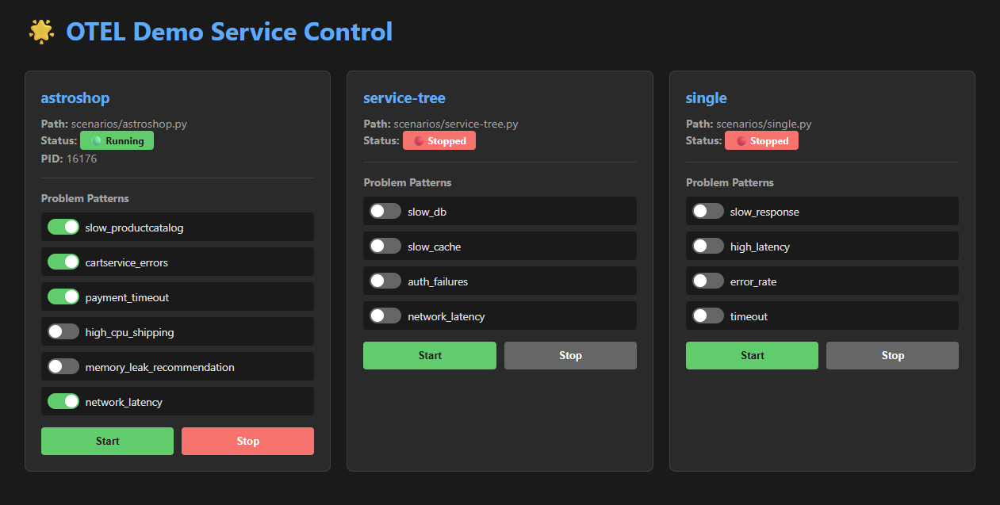

# OTel Demo Service

A comprehensive OpenTelemetry demonstration service that simulates realistic microservices architectures and generates distributed traces for monitoring and observability platforms like Dynatrace.

The demo scenarios were automatically generated by generative AI in order to realistically simulate an existing scenario and to copy the popular astroshop store without actually running the necessary hardware. The OTel Demo Service simply simulates the Open Telemetry traces and spans according to the given scenario without running the infrastructure. The OTel Demo Service therefore acts as a load generator for observability platforms for testing purposes.

## How to configure

General OpenTelemetry ingest endpoint and authentication needs to be set as environment variables:

- DT_OTEL_ENDPOINT: e.g., https://{environment-id}.live.dynatrace.com/api/v2/otlp/v1/traces
- DT_OTEL_API_KEY: Your Dynatrace API token for OTLP ingestion
- APP_ADMIN_PASSWORD (mandatory): Admin password for dashboard login, must be set
- FLASK_SECRET_KEY (optional): Secret key for Flask session encryption (auto-generated if not set)

## Features

- **Secure Authentication**  Flask-based dashboard with encrypted password hashing
  - Login/logout functionality with session management
  - Werkzeug password hashing for security
  - Admin password from environment variable

- **Multiple Demo Scenarios**: Pre-built scenario scripts simulating different microservices patterns
  - single.py  Simple single-service trace generation
  - service-tree.py  Multi-tier service dependency tree
  - astroshop.py  Complete Astronomy Shop microservices architecture (10+ services)

- **Web Dashboard**  Interactive control panel on port 8080 to:
  - Start/stop scenarios as subprocesses
  - Toggle problem patterns in real-time
  - Control requests-per-minute (RPM) with slider
  - Monitor running scenarios and their PIDs
  - View live trace generation status

- **Problem Pattern Injection**  Simulate real-world issues without code changes:
  - Slow responses and high latency
  - Service errors and timeouts
  - Memory leaks and resource exhaustion
  - Network delays

- **OpenTelemetry Integration**  Generates standard OTLP/HTTP traces with:
  - gRPC service calls with realistic attributes
  - Kubernetes resource metadata
  - Database and cache operations
  - HTTP request/response spans

## Requirements

Python 3.8+ and the following packages (see requirements.txt):

`ash
pip install -r requirements.txt
`

## Usage

1. Create a .env file with your credentials:
`ash
DT_OTEL_ENDPOINT=https://your-env-id.live.dynatrace.com/api/v2/otlp/v1/traces
DT_OTEL_API_KEY=your_api_key
APP_ADMIN_PASSWORD=your_secure_password
`

2. Install and run:
`ash
pip install -r requirements.txt
python app.py
`

3. Navigate to http://localhost:8080/login and log in with your admin password

## Security Notes

- Passwords are hashed using Werkzeug's PBKDF2
- All API endpoints require authentication
- Session encryption uses Flask secret key
- Use a reverse proxy in production for HTTPS
