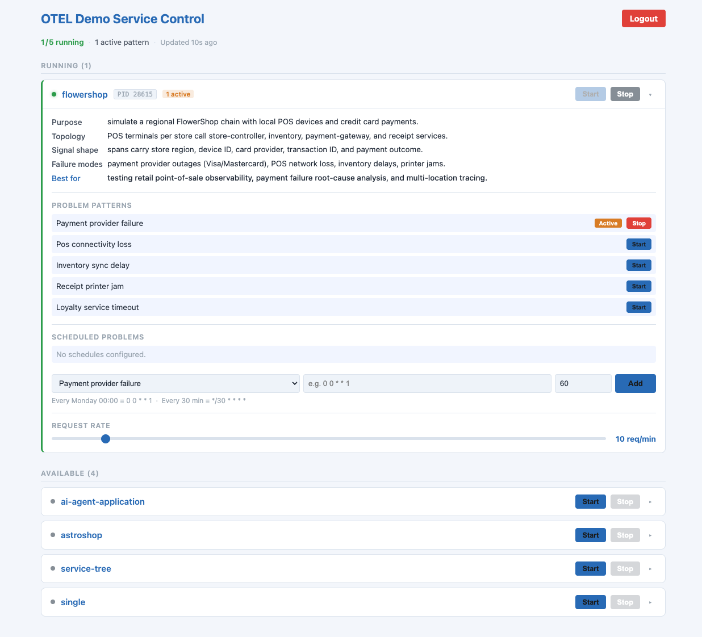

# OTel Demo Service

A comprehensive OpenTelemetry demonstration service that simulates realistic microservices architectures and generates distributed traces for monitoring and observability platforms like Dynatrace.

The demo scenarios were automatically generated by generative AI in order to realistically simulate an existing scenario and to copy the popular astroshop store without actually running the necessary hardware. The OTel Demo Service simply simulates the Open Telemetry traces and spans according to the given scenario without running the infrastructure. The OTel Demo Service therefore acts as a load generator for observability platforms for testing purposes.



## How to configure

General OpenTelemetry ingest endpoint and authentication needs to be set as environment variables:

- DT_OTEL_ENDPOINT: e.g., https://{environment-id}.live.dynatrace.com/api/v2/otlp/v1/traces
- DT_OTEL_API_KEY: Your Dynatrace API token for OTLP ingestion (scope 'openTelemetryTrace.ingest')
- APP_ADMIN_PASSWORD (mandatory): Admin password for dashboard login, must be set
- FLASK_SECRET_KEY (optional): Secret key for Flask session encryption (auto-generated if not set)

## How to run

Multiple options to run the OTel astroshop demo simulation service.

1. Run it directly in GitHub Codespaces
2. Deploy and run it as a Docker container in Kubernetes or any serverless runtime, e.g.: Google Cloud Run (with always on mode)
3. Run it on your local machine for testing purposes.

## Features

- **Secure Authentication**  Flask-based dashboard with encrypted password hashing
  - Login/logout functionality with session management
  - Werkzeug password hashing for security
  - Admin password from environment variable

- **Multiple Demo Scenarios**: Pre-built scenario scripts simulating different microservices patterns
  - single.py  Simple single-service trace generation
  - service-tree.py  Multi-tier service dependency tree
  - astroshop.py  Complete Astronomy Shop microservices architecture (10+ services)

- **Web Dashboard**  Interactive control panel on port 8080 to:
  - Start/stop scenarios as subprocesses
  - Configure cron-scheduled problem injections (pattern + cron + duration)
  - Control requests-per-minute (RPM) with slider
  - Monitor running scenarios and their PIDs
  - View live trace generation status

- **Command Line Interface**  Scriptable scenario control optimized for AI agents:
  - Standard `help` command and argparse `--help`
  - JSON output by default for deterministic parsing
  - Start/stop scenarios from the terminal
  - List scenarios, schedules, and available problem patterns
  - Add and remove cron-scheduled problem injections

- **Problem Pattern Injection**  Simulate real-world issues without code changes:
  - Slow responses and high latency
  - Service errors and timeouts
  - Memory leaks and resource exhaustion
  - Network delays

- **OpenTelemetry Integration**  Generates standard OTLP/HTTP traces with:
  - gRPC service calls with realistic attributes
  - Kubernetes resource metadata
  - Database and cache operations
  - HTTP request/response spans

## Requirements

Python 3.8+ and the following packages (see requirements.txt):

```bash
pip install -r requirements.txt
```

## Usage

1. Create a .env file with your credentials:

```bash
DT_OTEL_ENDPOINT=https://your-env-id.live.dynatrace.com/api/v2/otlp/v1/traces
DT_OTEL_API_KEY=your_api_key
APP_ADMIN_PASSWORD=your_secure_password
```

2. Install and run:

```bash
pip install -r requirements.txt
python app.py
```

3. Navigate to http://localhost:8080/login and log in with your admin password

## Cron scheduling for problem scenarios

The dashboard supports scheduling problem injections with a cron expression instead of enabling problems manually.

For each schedule entry you can define:

- **Problem scenario**: the issue pattern to activate for the selected demo scenario
- **Cron schedule**: a standard 5-field cron expression in the format `minute hour day-of-month month day-of-week`
- **Duration**: how long the problem should remain active after the cron trigger fires

This allows you to configure multiple recurring problem windows for the same scenario, for example:

- Every Monday at 00:00 → AstroShop slowdown → for 1 hour
- Every Tuesday at 13:00 → AstroShop error increase → for 2 hours

Example cron expressions:

- `0 0 * * 1` → every Monday at 00:00
- `0 13 * * 2` → every Tuesday at 13:00
- `*/15 * * * *` → every 15 minutes

When a schedule becomes active, the corresponding problem pattern is applied automatically by the running scenario process.

## CLI usage

The project includes an AI-friendly command line interface in [otel-demo-cli.py](otel-demo-cli.py) for managing scenarios without using the web UI.

🤖✨ Built by AI, for AI agents — because even robots deserve first-class tooling. 🤝🧠

### Why this CLI is AI-agent friendly

- JSON output by default (`--format json`)
- Stable, non-interactive commands
- Standard help output and deterministic exit codes
- Exit code `0` on success, non-zero on errors

### Help

```bash
python otel-demo-cli.py help
python otel-demo-cli.py --help
python otel-demo-cli.py help add-schedule
```

### List scenarios and status

```bash
python otel-demo-cli.py list
```

### Start and stop scenarios

```bash
python otel-demo-cli.py start astroshop
python otel-demo-cli.py stop astroshop
```

### List available problem patterns

```bash
python otel-demo-cli.py problems
python otel-demo-cli.py problems astroshop
```

### List configured schedules

```bash
python otel-demo-cli.py schedules
python otel-demo-cli.py schedules astroshop
```

### Add and remove cron schedules

```bash
python otel-demo-cli.py add-schedule astroshop --pattern slow_productcatalog --cron "0 0 * * 1" --duration-minutes 60
python otel-demo-cli.py add-schedule astroshop --pattern slow_productcatalog --cron "0 12 * * 2" --duration-minutes 60
python otel-demo-cli.py remove-schedule astroshop <schedule-id>
```

### Optional text output

```bash
python otel-demo-cli.py --format text list
```

## Security Notes

- Passwords are hashed using Werkzeug's PBKDF2
- All API endpoints require authentication
- Session encryption uses Flask secret key
- Use a reverse proxy in production for HTTPS
